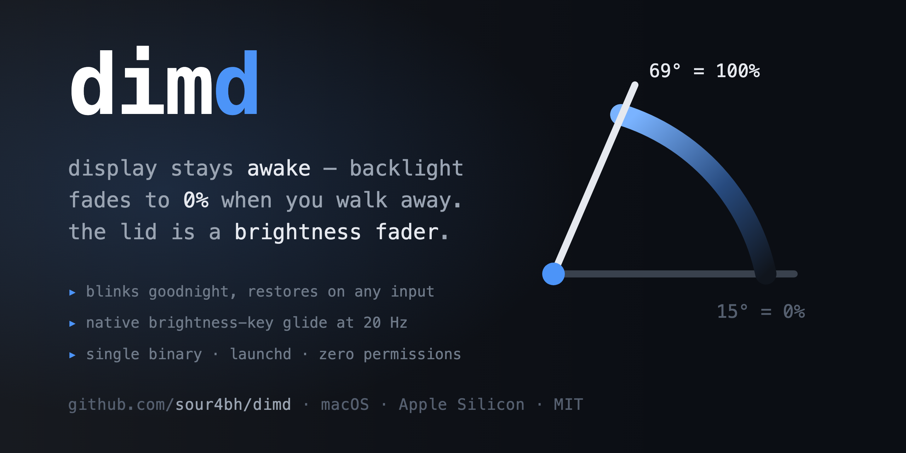

# dimd



**Idle backlight dimmer for MacBooks that stay awake to run background agents —
plus a lid-angle brightness fader.**

[](https://github.com/sour4bh/dimd/releases)
[-black)](#requirements)
[](Makefile)
[](LICENSE)

The display stays awake, the backlight blinks goodnight and fades to 0% when
you walk away, and any keypress brings it back instantly. Tilt the lid and it
becomes a physical brightness knob, gliding with the native brightness-key
animation. Single binary, no dependencies, no accessibility permissions.

## Install

```sh
git clone https://github.com/sour4bh/dimd && cd dimd
make install     # build, install launchd agent
dimd demo        # see the goodnight blink + fade + restore
```

## Why

`pmset -c displaysleep 0` keeps the display awake whenever on AC power, so GUI
workflows (browser automation, screen capture) never hit WindowServer occlusion
throttling. But that leaves the panel burning at full brightness 24/7. macOS has
no native "stay awake, backlight off" mode — display sleep is all-or-nothing.

dimd fills the gap: it fades the built-in backlight to 0% when you walk away,
while the display stays technically awake.

## Behavior

| State | Display | Backlight |
|---|---|---|
| Battery | sleeps (native `displaysleep 10`) | untouched |
| AC, external monitor connected | never sleeps | untouched |
| AC, no monitor, input active | never sleeps | untouched |
| AC, no monitor, idle past threshold | never sleeps | fades to 0% |

Dimming announces itself with a goodnight double-blink before the backlight
closes. Restore is instant (≤ 0.25 s) on any input, monitor connect, or switch
to battery.

With `lidfader=on`, the lid becomes a physical brightness knob: at 69° and
above the panel stays at your setpoint (brightness keys keep working, the
daemon follows them); tilting below 69° scales the backlight down to 0% at
15°, tracked at 60 Hz while the lid moves. The idle goodnight-dim still
applies on top. Brightness is saved before dimming and restored exactly; the saved
value persists across daemon restarts (`~/.local/state/dimd/brightness`).

## Commands

```
dimd status              power / displays / idle / brightness / lid angle
dimd blink               play the goodnight blink at current brightness
dimd demo                blink, fade to black, hold, restore
dimd dim                 dim now (next input restores)
dimd wake                restore the backlight now
dimd set <0-100>         set brightness with a smooth ramp
dimd lid [--watch]       read the lid angle sensor
dimd fader               lid angle drives the backlight, live (Ctrl-C restores)
                         your current brightness at 69° and above; fades out toward 15°
dimd config              show configuration
dimd config set <k> <v>  set a key (restarts the daemon)
dimd selftest            verify brightness control works
dimd daemon              run the idle watcher (used by launchd)
```

## Configuration

`~/.config/dimd/config`, key=value lines:

| Key | Default | Meaning |
|---|---|---|
| `threshold` | `600` | idle seconds before dimming |
| `blinks` | `2` | goodnight blinks before the fade |
| `dip` | `0.35` | blink dip depth (0–1, fraction of current brightness) |
| `fade` | `0.9` | fade-to-black duration in seconds |
| `lidfader` | `off` | lid angle drives the backlight, always-on in the daemon |

`dimd config set` writes the file and restarts the daemon; if you edit the file
by hand, `launchctl kickstart -k gui/$(id -u)/local.dimd` to reload.

## Requirements

- `pmset -c displaysleep 0` (one-time, sudo)
- Brightness control uses the private `DisplayServices` framework — the only
  per-display brightness API that reaches the built-in panel on Apple Silicon
  (same route as the `brightness` CLI). `dimd selftest` verifies it.

## Managing

```sh
make status      # detected state + agent state
make log         # tail the daemon log
make uninstall   # bootout the agent, remove binary + plist
```

## Design notes

- The statefile (`~/.local/state/dimd/brightness`) is the single source of
  truth for "dimmed": the daemon, `dimd dim`, and `dimd wake` coordinate
  through it, so a manual dim gets restore-on-input for free and dims survive
  daemon restarts. Its mtime marks when the dim began, so only input *newer
  than the dim* wakes it.
- `dimd lid` reads the lid angle HID sensor (usage page 0x20, usage 0x8A,
  feature report 1) on Apple Silicon MacBooks. `dimd fader` maps the angle
  (15°–69°) onto the backlight, topping out at whatever brightness you
  started with — groundwork for lid-angle automations (dim on half-closed
  lid, peek-to-wake).
- `DisplayServicesSetBrightnessSmooth(display, delta)` is the native animated
  ramp the brightness keys use — its float argument is a **delta from current**,
  not an absolute target (pass an absolute and it silently clamps; this is why
  it's often reported as broken). `rampBrightness` wraps it; the fader
  retargets it at 20 Hz and the system interpolates. Software 120 Hz
  micro-stepping remains as the fallback and for the timed goodnight
  animation.

## Notes

- The display never sleeping on AC means no display-sleep auto-lock; the screen
  saver lock (if configured) still applies.
- If "Automatically adjust brightness" fights the 0% level, disable it in
  System Settings → Displays.
